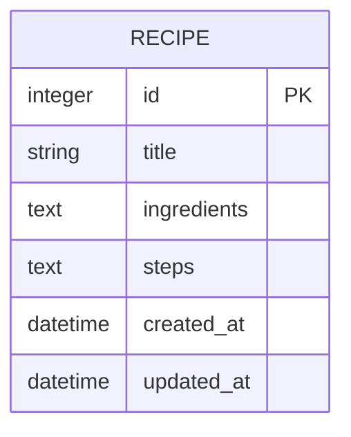

# 食譜收藏系統 - 資料庫設計 (DB DESIGN)

## 1. ER 圖（實體關係圖）

目前系統核心需求為獨立的「食譜」管理，未來可以擴充標籤或分類。目前的資料庫結構如下：



## 2. 資料表詳細說明

### `recipe` (食譜表)

儲存所有食譜的核心資料，包含名稱、材料、步驟與時間紀錄。

| 欄位名稱 | 型別 | 必填 | 說明 |
| :--- | :--- | :--- | :--- |
| `id` | INTEGER | 是 | Primary Key，自動遞增的主鍵。 |
| `title` | VARCHAR(100)| 是 | 食譜名稱（例如：番茄炒蛋）。 |
| `ingredients` | TEXT | 是 | 材料清單，可由前端透過換行符號區隔，或直接輸入純文字。 |
| `steps` | TEXT | 是 | 烹飪步驟，詳細的做法說明。 |
| `created_at` | DATETIME | 是 | 食譜建立時間，預設為當下 UTC 時間 (或資料庫 Current Timestamp)。 |
| `updated_at` | DATETIME | 是 | 食譜最後更新時間，預設為當下 UTC 時間，更新時自動刷新。 |

## 3. SQL 建表語法

位於 `database/schema.sql`，可直接用於 SQLite 初始化。

```sql
CREATE TABLE IF NOT EXISTS recipe (
    id INTEGER PRIMARY KEY AUTOINCREMENT,
    title VARCHAR(100) NOT NULL,
    ingredients TEXT NOT NULL,
    steps TEXT NOT NULL,
    created_at DATETIME DEFAULT CURRENT_TIMESTAMP,
    updated_at DATETIME DEFAULT CURRENT_TIMESTAMP
);
```

## 4. Python Model 程式碼 (SQLAlchemy)

選用 `SQLAlchemy`，並設計以下常用功能：

- 基礎 `id` / `title` / `ingredients` / `steps` / `created_at` / `updated_at` 對映欄位。
- **CRUD 方法**：
  - `create(title, ingredients, steps)`：建立新的食譜並存入資料庫。
  - `get_all()`：取得所有食譜，預設依照建立時間新至舊排序。
  - `get_by_id(recipe_id)`：取得單一食譜詳細資訊。
  - `search(keyword)`：透過模糊字串搜尋比對 `title` 與 `ingredients` 欄位。
  - `update(title, ingredients, steps)`：更新特定食譜欄位並提交修改。
  - `delete()`：刪除當下指標的食譜實體。

（詳細程式碼實踐請見 `app/models/recipe.py` 及初始化檔 `app/models/__init__.py`）
