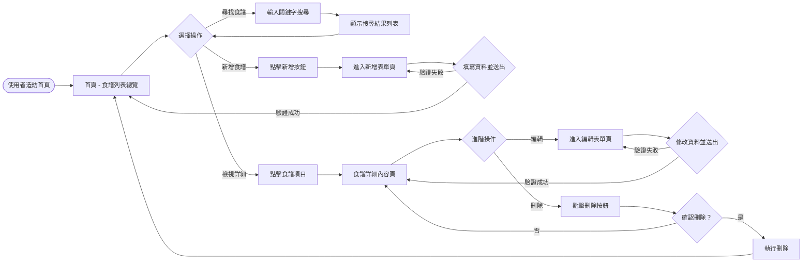
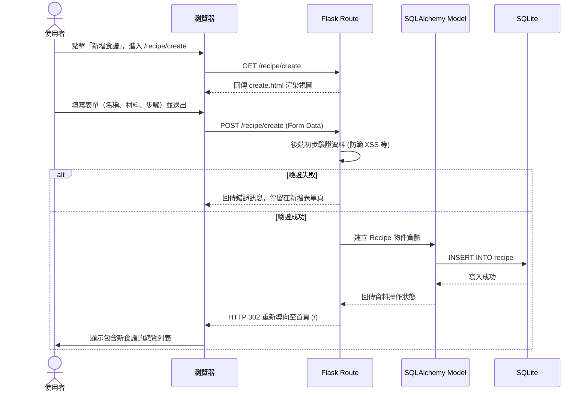

# 食譜收藏系統 - 流程圖設計 (FLOWCHART)

## 1. 使用者流程圖 (User Flow)

這個流程圖展示了使用者在網站中的主要操作路徑，包含瀏覽、尋找、新增、編輯與刪除食譜。

## 2. 系統序列圖 (Sequence Diagram)

這張序列圖展示了當使用者執行「新增食譜」時，系統前後端及資料庫的完整互動流程。

## 3. 功能清單對照表

根據 PRD 定義的使用需求與架構設計，以下是規劃對應的 URL 路徑與 HTTP 請求方法：

| 功能項目 | URL 路徑 | HTTP 方法 | 對應模板 (View) 或 處理邏輯 |
| :--- | :--- | :--- | :--- |
| **首頁 / 列表總覽** | `/` | GET | `index.html` - 取得所有食譜並顯示清單。 |
| **搜尋食譜** | `/?q=關鍵字` | GET | `index.html` - 解析網址的查詢參數，過濾顯示的結果。 |
| **進入新增表單頁** | `/recipe/create` | GET | `create.html` - 提供空白的新增表單。 |
| **執行新增表單** | `/recipe/create` | POST | 接收資料、驗證、寫入資料庫，完成後導回 `/`。 |
| **檢視食譜細節** | `/recipe/<id>` | GET | `detail.html` - 根據傳入的 ID，顯示此食譜之材料與步驟。 |
| **進入編輯表單頁** | `/recipe/<id>/edit` | GET | `edit.html` - 取得指定食譜的現有資料，並帶入表單中。 |
| **執行編輯表單** | `/recipe/<id>/edit` | POST | 接收更新的資料，寫入資料庫，完成後導引回 `/recipe/<id>`。 |
| **執行刪除食譜** | `/recipe/<id>/delete` | POST | 安全起見使用 POST，驗證後執行刪除，導引回首頁 `/`。 |
